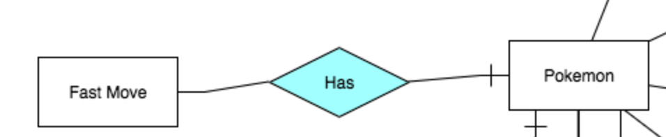
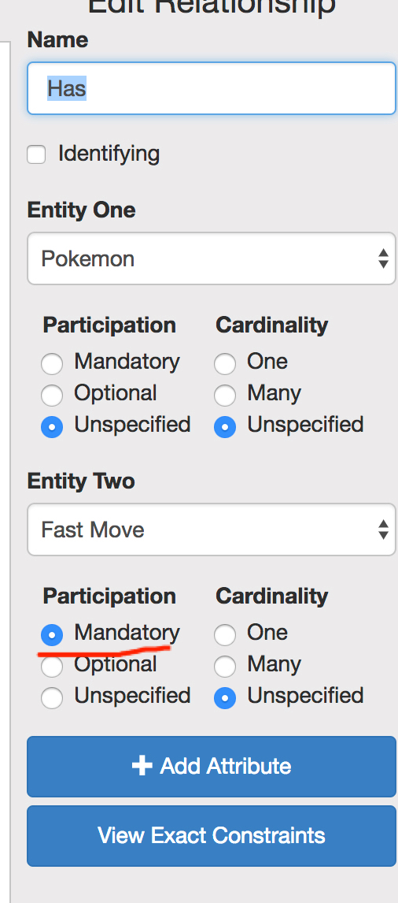
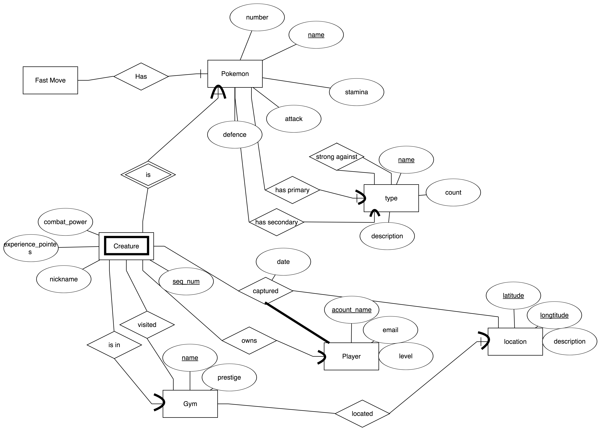
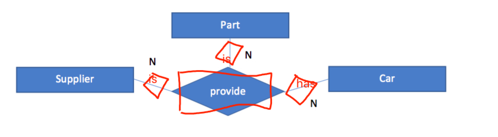

cs348-hw1 
Name: Ji Ma 
Email: ma438@purdue.edu 

# Part 2

### 2.1. E-R Diagram (35 points)

Some thing needs to be noticed. Since the software I used can't draw double line, so the mandatory participation will be showed like this to signal double line. Which is total participation.

Assumptions:

1. Every fast move is part of same pokemon.
2. Type has only one unique name.
3. Every pokemon has only one primary type.
4. For every type is strong against 0 or more other types.
5. Different pokemon could have same fast moves.
6. A creature could be capture and then released, which could allow other player to capture it later on.

### 2.2  Converting an E-R Diagram to the relational model (35 points)

There is no underline in markdown, so I use bold for primary key.

***Type***

__name__ | count | description | strong\_against\_type

name: primary key 
strong\_against\_type: type foreigh key

***Pokemon***

__name__ | number | stamina | attack | defense | primary\_type\_name | secondary\_type\_name

name: primary key 
primary\_type\_name: type foreigh key 
secondary\_type\_name: type foreigh key

***Creature***

**seq_num** | combat\_power | experience\_points | nickname | pokemon\_name

seq\_num: the sequance number for creature 
pokemon\_name: foreigh key to pokemon
Creature is a weak entity.

***Gym***

 **name** | prestige | longitude | latitude
 
Name: primary key 
Longitude, Latitude: foreign key to location

***Occupied(is in)***

seq\_num | pokemon\_name | gym\_name

seq\_num, pokemon\_name: foreign key to creature 
gym\_name: foreign key to gym

***Player***

**account_name** | email | level

account\_name: primary key for player

***visited***

seq\_num | pokemon\_name | gym\_name

seq\_num, pokemon\_name: foreign key to creature 
gym\_name: foreign key to gym

***Owns***

account\_name | **seq\_num** | **pokemon\_name**

account\_name: primary key for player 
seq\_num, pokemon\_name : foreign key to creature

***Captured***

**account\_name** | **seq\_num** | **pokemon\_name** | **longitude** | **latitude**

account\_name: primary key for player 
seq\_num, pokemon\_name : foreign key to creature 
Longitude, Latitude: foreign key to location

### 2.3. ER Basics (30 points)

(15 points) Convert in the ER diagram below showing ternary relationships into equivalent ER diagram having only binary relationship. Also, convert the ER diagram into an equivalent relational model.

Car, Part and Supplier will just have it's own unique id in each table, plus there will be three relation table and one provider table showing as below.

***Car and provider***

**id** | **provider\_id **

id: foreign key for car 
provide\_id : foreign key for provider

***Supplier and provider***

**id** | **provider\_id **

id: foreign key for supplier 
provide\_id : foreign key for provider

***Part***

**id** | **provider\_id **

id: foreign key for part 
provide\_id : foreign key for provider

***Provide***

**provider\_id**

provide\_id : foreign key for provider

(15 points)
a. What is the primary key of a weak entity when converted to the relational model, explain with example.

A weak entity's primary key consists extra discriminator attibutes and its identifying entity's primary key. For example, course and lab in purdue. Lab can't exists alone without courses. Every course has a course id and every lab has a lab id. And different labs of same course can't have the same lab id. But, different courses labs could have the same lab id. So, the lab's primary key is including course id, course primary key, and lab id.

b. What are the advantages of weak entity set, why do not we always create strong entities? Explain with example.

The benefit of using weak entity set is that we don't need to create a unique key for every weak entity. Plus, the weak entity will have extra information of dependency. The reason of the case we don't wanna use the strong entity is the disability of creating unique key or identifier, or the entity depends on other entity. The example in the above will be correspondingly shows that the lab session can't exists without the existance of the course, so we choose weak entity.